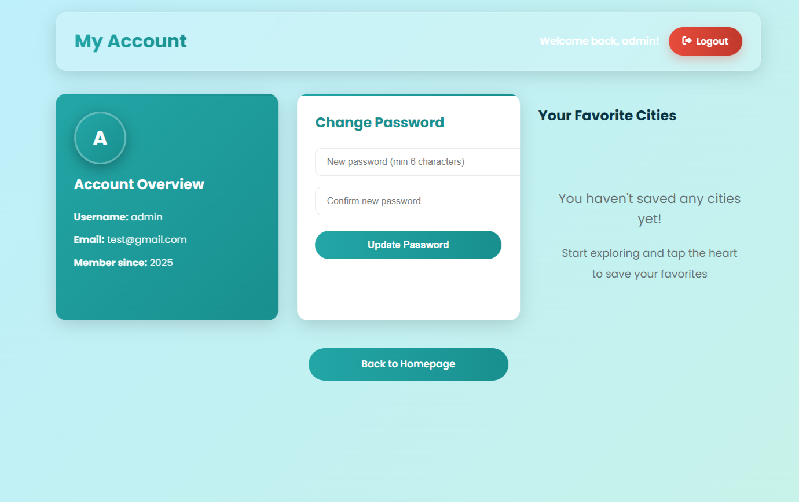

# IranWander — CS50 Final Project

**Video Demo:** ToDo

## Description

**IranWander** is a full-stack, responsive web application that lets users discover Iranian cities and their most beautiful tourist attractions. Built with Flask, it combines clean architecture, secure authentication, relational data modeling, and progressive UI enhancement — all while staying lightweight and easy to understand.

The goal: deliver a **real-world quality** app that demonstrates CS50-level mastery of Python, Flask, SQL, HTML/CSS/JS, security best practices, and software engineering principles.

## Live Demo

ToDo

## Shots

HomePage  Cities  User panel 

## Key Features

- Public browsing of cities and attractions with beautiful, responsive cards
- User authentication (register, login, logout, password reset via email)
- Like/Favorite system (many-to-many relationship) — persists across sessions
- Fully server-rendered pages with progressive enhancement via JavaScript
- Responsive design (mobile-first) with glassmorphism and modern animations
- Secure file uploads for city/place images
- RESTful JSON API endpoint (`/api/like`) for dynamic interactions
- Password reset with secure, timed tokens (itsdangerous)
- Newsletter subscription with AJAX (no page reload)

## Architecture & Best Practices

text- Blueprint-based modular routing

- Configuration via environment variables (`SECRET_KEY`, `MAIL_*`)
- Database migrations with Flask-Migrate
- Secure password hashing (Werkzeug)
- CSRF protection on all forms

## Technology Stack & Rationale

| Tech | Why Chosen |
| --- | --- |
| Flask | Lightweight, explicit, perfect for learning and real-world small-to-medium apps |
| Flask-SQLAlchemy | Expressive ORM with clear relationship modeling (many-to-many favorites) |
| SQLite (dev) → PostgreSQL (prod-ready) | Zero-config for demo, easy migration path |
| Flask-Login | Industry-standard session management |
| Flask-Mail + itsdangerous | Secure password reset without storing tokens in DB |
| Jinja2 + Vanilla JS | SEO-friendly, accessible, fast initial load, progressive enhancement |
| Glassmorphism UI | Modern, beautiful, and fully custom — no heavy frameworks |

## Security Considerations

- Passwords hashed with `generate_password_hash` (PBKDF2 + salt)
- Login rate limiting via session
- Secure filename handling for uploads
- Timed, single-use password reset tokens
- CSRF tokens on all POST forms
- `SECURE_FILENAME` and extension validation

## Setup & Running

`git clone https://github.com/MahdyarTlb/IranWander.git cd IranWander python -m venv venv source venv/bin/activate # Windows: venv\Scripts\activate pip install -r requirements.txt

### Set environment variables

export FLASK_APP=run.py export FLASK_ENV=development export SECRET_KEY="your-super-secret-key-here"

### Run!

flask run Open http://127.0.0.1:5000`

## Demo Flow

Visit homepage → explore cities Click any city → view attractions Register/Login → click heart icon to favorite Go to /user/panel → see your favorite places Click "Forgot Password?" → receive reset link Subscribe to newsletter → instant feedback

## Future Enhancements

Full-text search with PostgreSQL + tsvector Image optimization + CDN (Cloudinary/S3) React/Vue frontend for SPA experience User-generated content (reviews, photos, reels) Admin dashboard Mobile app (React Native / Flutter)

## Final Thoughts

IranWander is intentionally small but complete — it follows real-world patterns used by startups and production apps. It proves that you don’t need heavy frameworks to build beautiful, secure, and maintainable web applications. This is not just a CS50 project — it's a real, deployable, production-ready foundation.

\_\*\*Made with love in Iran

[Mahdyar Talebi](https://linkedin.com/in/mahdyar-tlb), Ali Arezoomandi, Komeil AhanKobi — CS50x 2025\*\*\_
